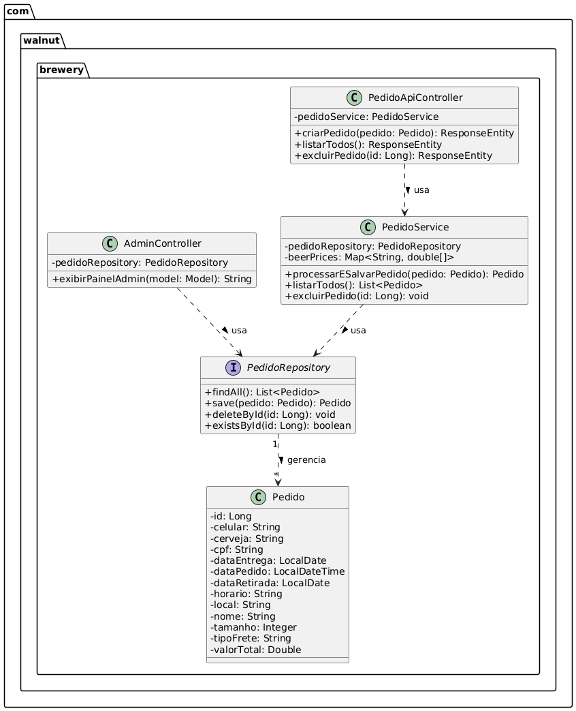

# 🍺 Walnut Brewery - Sistema de Reservas e Gestão de Chopp

Trabalho Prático - Unidade Curricular: Modelos, Métodos e Técnicas de Engenharia de Software (UniBH)
**Professor:** Lucas Goulart Silva
**Integrantes:** Pedro Picinin Velloso Vieira - 12410337
Luiz Antônio Gomes Vicente -12313884
Leonardo Alves Silva - 124221849
Sabrina Abade Fernandes Ribeiro - 124222032
Rafael Moura Souza - 124222140

---

## 1. Definição do Problema
O problema identificado pertence ao contexto comercial e operacional de uma cervejaria artesanal local. Atualmente, muitos estabelecimentos desse porte gerenciam reservas de barris de chopp de forma manual (via WhatsApp ou planilhas). Isso gera gargalos no atendimento, erros de cálculo de frete ou valores de barris, e perda de dados importantes.

Além disso, a ausência de autenticação para acesso ao painel administrativo compromete a segurança das informações do negócio, e a falta de indicadores gerenciais dificulta o acompanhamento do desempenho das vendas e da operação.

**Nossa Solução:** Desenvolvemos uma plataforma web (Front-end) integrada a uma API REST (Back-end Java) que automatiza o processo de reserva. O sistema calcula automaticamente os valores com base no rótulo, volume e tipo de entrega, registrando todas as reservas de forma segura em um banco de dados persistente e disponibilizando um painel administrativo para a gestão do negócio.

Como evolução do projeto, foram propostas as seguintes melhorias:

* **Controle de Estoque:** implementação de um módulo responsável por gerenciar a quantidade disponível de barris por rótulo e volume, impedindo que sejam realizadas reservas de produtos indisponíveis e atualizando automaticamente o estoque após cada confirmação de reserva.

* **Autenticação do Administrador:** inclusão de um mecanismo de login para restringir o acesso ao painel administrativo, garantindo que apenas usuários autorizados possam visualizar informações gerenciais e administrar as reservas do sistema.

* **Dashboard Gerencial Aprimorado:** expansão do painel administrativo com indicadores e estatísticas, como faturamento estimado, quantidade de reservas realizadas, litros vendidos e rótulos mais vendidos, oferecendo maior apoio à tomada de decisão e ao acompanhamento do desempenho da cervejaria.

Com essas melhorias, a solução passa a oferecer maior confiabilidade operacional, segurança de acesso e suporte gerencial, tornando o processo de reservas mais eficiente e reduzindo falhas comuns presentes no gerenciamento manual.

## 2. Levantamento e Análise de Requisitos
Optamos por uma **abordagem ágil** para a elicitação de requisitos, utilizando Histórias de Usuário (User Stories):

* **US01:** Como cliente, eu quero preencher um formulário de reserva escolhendo o tamanho do barril (30L ou 50L) e o rótulo da cerveja, para garantir meu chopp para um evento de forma autônoma.
* **US02:** Como cliente, eu quero ver o resumo da minha reserva (valores dos produtos e do frete) atualizado reativamente em tempo real na tela, para saber exatamente quanto vou pagar antes de confirmar o pedido.
* **US03:** Como administrador da cervejaria, eu quero acessar um painel restrito que me mostre o faturamento estimado, a volumetria de barris vendidos e uma lista cronológica de todas as reservas, para gerenciar as entregas e a operação diária.

## 3. Desenvolvimento da Solução e Arquitetura

O sistema foi desenvolvido utilizando as seguintes tecnologias:
- **Linguagem:** Java 21
- **Framework:** Spring Boot 3.2.5 (Web, Data JPA e Spring Security)
- **Banco de Dados:** H2
- **Frontend:** HTML, CSS, JavaScript e Thymeleaf
- **Testes:** JUnit 5 e Mockito

### Aplicação dos Princípios SOLID

O projeto foi estruturado seguindo os princípios SOLID, destacando-se:

* **Single Responsibility Principle (SRP):** Cada classe possui uma responsabilidade bem definida. O `PedidoService` concentra apenas as regras relacionadas ao processamento dos pedidos, enquanto o `EstoqueService` é responsável exclusivamente pelo gerenciamento do estoque e o `AdminController` apenas prepara as informações para apresentação no painel administrativo.

* **Dependency Inversion Principle (DIP):** Os serviços dependem de abstrações fornecidas pelo Spring por meio da Injeção de Dependências (`@Autowired`), reduzindo o acoplamento entre controladores, serviços e repositórios e facilitando a manutenção e os testes da aplicação.

* - **Service Layer:** A lógica de negócio foi organizada em classes de serviço (`PedidoService` e `EstoqueService`), separando as regras de negócio da camada de controle e promovendo maior reutilização e manutenção do código.
 
  * - **Testes Unitários:** Foram implementados testes unitários utilizando JUnit 5 e Mockito. A classe PedidoServiceTest valida o cálculo do valor das reservas, as validações de rótulos de cerveja e o novo fluxo de controle de estoque, garantindo que pedidos sejam processados apenas quando houver disponibilidade. O uso do Mockito permitiu isolar os testes das dependências externas, simulando o comportamento dos repositórios e serviços utilizados pela aplicação.

## 4. Modelagem da Solução

Abaixo apresentamos o Diagrama de Classes focando no Back-end, evidenciando as Entidades, Repositórios, Serviços e Controladores:

## 5. Melhorias implementadas 
* Controle de Estoque;
* Login do Administrador com Spring Security;
* Dashboard Gerencial com novos indicadores.

## 6. Como Executar a Aplicação

Para rodar este projeto, o único requisito é ter o **Java JDK 21** (ou superior) instalado na máquina. 

**Passo a passo:**
1. Faça o clone deste repositório.
2. Abra o terminal na raiz do projeto e execute o comando usando o Maven Wrapper embutido:
   * No Windows: `.\mvnw spring-boot:run`
   * No Linux/Mac: `./mvnw spring-boot:run`
3. O servidor inicializará no Tomcat embarcado na porta **8080**.

**Acessando as Interfaces:**
* **Site do Cliente:** [http://localhost:8080](http://localhost:8080)
* **Painel Administrativo:** [http://localhost:8080/admin](http://localhost:8080/admin)
* **Console H2:** [http://localhost:8080/h2-console](http://localhost:8080/h2-console) (JDBC URL: `jdbc:h2:file:./db/walnutdb`, User: `sa`, Senha em branco).
